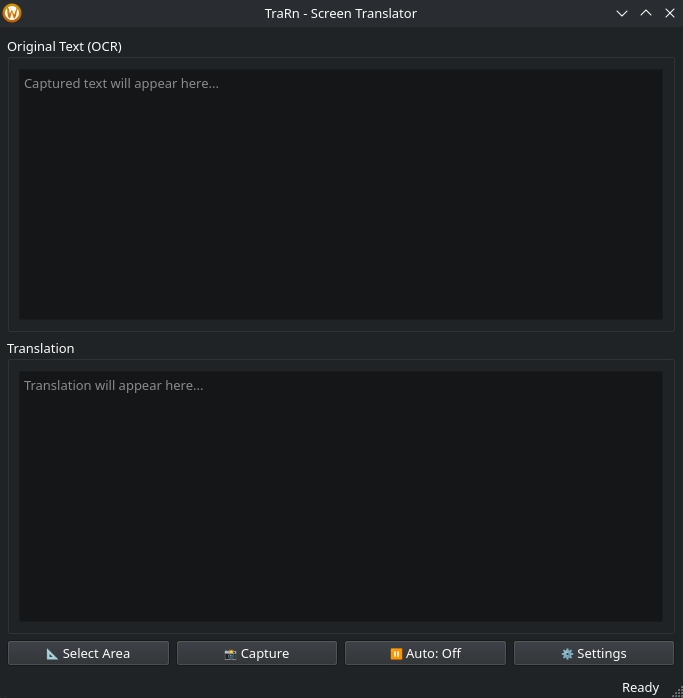
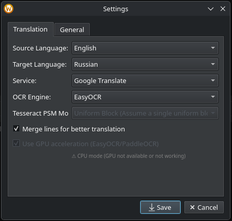

# TraRn — Screen Translation Application

<div align="center">


</div>

## 📖 Описание / Description

**[EN]** TraRn is a screen translation application for Linux that captures text from any screen region, recognizes it using OCR, and translates it to your preferred language in real-time.

**[RU]** TraRn — это приложение для перевода текста с экрана в Linux. Оно захватывает текст из любой области экрана, распознает его с помощью OCR и переводит на выбранный язык в реальном времени.

---

## ✨ Features / Возможности

| EN | RU |
|----|----|
| Select any screen region | Выбор любой области экрана |
| Auto-translate with configurable interval | Автоперевод с настраиваемым интервалом |
| Quick toggle with F6 hotkey | Быстрое переключение горячей клавишей F6 |
| Multiple translation services (Google, DeepL) | Несколько сервисов перевода (Google, DeepL) |
| OCR engines: Tesseract, EasyOCR | Движки OCR: Tesseract, EasyOCR |
| Wayland & X11 support | Поддержка Wayland и X11 |
| System tray integration | Интеграция с системным треем |
| Silent mode during auto-capture | Тихий режим при автозахвате |

---

## 🖼️ Screenshots / Скриншоты

<div align="center">

*Main Window / Главное окно*



*Settings / Настройки*



</div>

---

## 📦 Installation / Установка

### Step 1: System Dependencies / Системные зависимости

#### **KDE Plasma (Wayland/X11)**
```bash
# KDE Plasma (No additional dependencies required)
# KDE Plasma (Дополнительные зависимости не требуются)
```

#### **GNOME / Other Wayland**
```bash
# Arch Linux
sudo pacman -S grim slurp tesseract tesseract-data-eng tesseract-data-rus

# Debian/Ubuntu
sudo apt install grim slurp tesseract-ocr tesseract-ocr-eng tesseract-ocr-rus

# Fedora
sudo dnf install grim slurp tesseract tesseract-langpack-eng tesseract-langpack-rus
```

#### **X11 (Xorg)**
```bash
# Arch Linux
sudo pacman -S maim tesseract tesseract-data-eng tesseract-data-rus

# Debian/Ubuntu
sudo apt install maim tesseract-ocr tesseract-ocr-eng tesseract-ocr-rus
```

### Step 2: Python Dependencies / Python зависимости

```bash
# Create virtual environment (recommended) / Создать виртуальное окружение (рекомендуется)
python -m venv venv
source venv/bin/activate

# Install dependencies / Установить зависимости
pip install -r requirements.txt
```

---

## 🚀 Usage / Использование

### Starting the Application / Запуск приложения

```bash
python main.py
```

### Quick Start Guide / Быстрый старт

| Step | EN | RU |
|------|----|----|
| 1 | Click **"Select Area"** | Нажмите **"Select Area"** |
| 2 | Drag to select the region with text | Перетащите для выбора области с текстом |
| 3 | Click **"Capture"** to translate | Нажмите **"Capture"** для перевода |
| 4 | Press **F6** to toggle auto-translate | Нажмите **F6** для включения автоперевода |

### Hotkeys / Горячие клавиши

| Key | Action |
|-----|--------|
| **F6** | Toggle auto-translate ON/OFF / Включить автоперевод |

### System Tray Menu / Меню системного трея

- **Show Window** — Показать окно
- **Capture Now** — Захватить сейчас
- **Auto-translate** — Автоперевод (вкл/выкл)
- **Settings** — Настройки
- **About** — О программе
- **Quit** — Выход

---

## ⚙️ Settings / Настройки

### Translation Tab / Перевод

| Setting | EN | RU |
|---------|----|----|
| Source Language | Language of captured text | Язык исходного текста |
| Target Language | Language to translate to | Язык перевода |
| Service | Translation service (Google/DeepL) | Сервис перевода (Google/DeepL) |
| OCR Engine | Recognition engine (Tesseract/EasyOCR) | Движок распознавания |

### General Tab / Общие

| Setting | EN | RU |
|---------|----|----|
| Auto-translate | Enable periodic capture | Включить периодический захват |
| Interval | Time between captures (1-300 sec) | Время между захватами (1-300 сек) |
| Minimize to tray | Close button minimizes to tray | Кнопка закрытия сворачивает в трей |
| Start minimized | Start application minimized | Запускать свёрнутым |
| Clear Selected Area | Reset capture area | Сбросить область захвата |

---

## 🔧 Configuration Files / Файлы конфигурации

Settings are stored in / Настройки хранятся в:
```
~/.config/trarn/settings.json
```

### Example Configuration / Пример конфигурации

```json
{
  "source_language": "auto",
  "target_language": "en",
  "ocr_engine": "tesseract",
  "translation_service": "google",
  "auto_translate": true,
  "auto_translate_interval": 10,
  "capture_area": [100, 100, 400, 200],
  "minimize_to_tray": true,
  "start_minimized": false
}
```

---

## 📋 Requirements / Требования

### System / Системные

| Component | EN | RU |
|-----------|----|----|
| OS | Linux (Wayland or X11) | Linux (Wayland или X11) |
| Display Server | Wayland (KDE, GNOME, sway) or X11 | Wayland (KDE, GNOME, sway) или X11 |
| Screenshot Tool | spectacle / grim / maim | spectacle / grim / maim |
| OCR | Tesseract 5+ | Tesseract 5+ |

### Python / Python

```
PyQt6>=6.4.0
pytesseract>=0.3.10
Pillow>=9.0.0
deep-translator>=1.11.4
easyocr>=1.7.0
PyGObject>=3.42.0
```

---

## 🤝 Contributing / Вклад

**[EN]** Contributions are welcome! Feel free to:
- Report bugs
- Suggest features
- Submit pull requests

**[RU]** Вклад приветствуется! Не стесняйтесь:
- Сообщать об ошибках
- Предлагать функции
- Отправлять pull-реквесты

---

## 📧 Contact / Контакты

**[EN]** For questions, suggestions, or bug reports, please open an issue on GitHub.

**[RU]** По вопросам, предложениям или сообщениям об ошибках, пожалуйста, создайте issue на GitHub.

---

<div align="center">

⭐ **Star this project if you find it useful!**  
⭐ **Поставьте звезду, если проект оказался полезен!**

</div>
